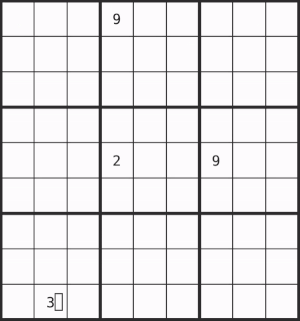

# Wave Function Collapse Sudoku Solver

Automatic Sudoku solver implemented using the Wave Function Collapse approach.

Because of the way Wave Function Collapse works, it is possible (and quite common) to reach a state where the game is no longer solvable (as you can see in the gif - it is not solved correctly).

This project was created to explore how Wave Function Collapse algorithms work, not to solve Sudokus :v (maybe it will change in the future).